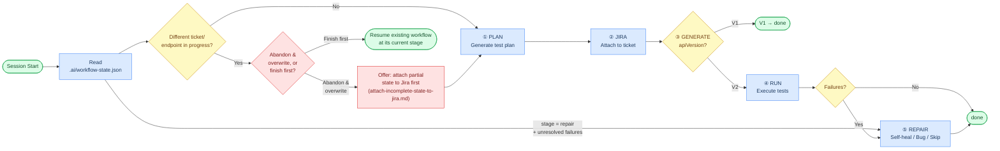
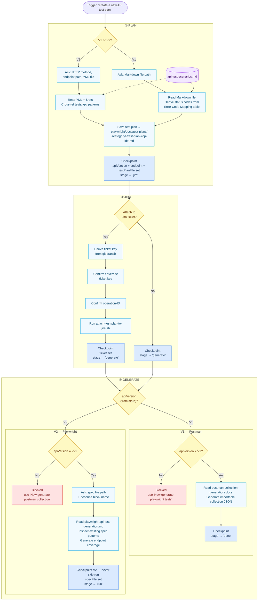

# Cline Workflow Diagram — `.clinerules/` Journey Map

This diagram visualizes the end-to-end journey defined across `.clinerules/.clinerules.md`, using `playwright/docs/api-test-scenarios.md` as the reference ruleset consumed during test plan generation.

The workflow is driven by a **persistent state file**, `.ai/workflow-state.json`. Every task starts by reading this file to determine the current `stage`. The overall stage sequence is:

- **V2:** `plan → jira → generate → run → repair → done`
- **V1:** `plan → jira → generate → done`

---

## Diagram 1 — High-Level Stage Map

> The "you are here" overview. Read this first to orient yourself before diving into the detail diagrams below.

---

## Diagram 2 — Plan → Jira → Generate

> Covers stages `plan`, `jira`, and `generate`. Applies to both V1 and V2 workflows.

---

## Diagram 3 — Run → Repair → Done _(V2 only)_

> Covers stages `run` and `repair`. Only reached when `apiVersion = V2`.

```mermaid
flowchart TD
    classDef action fill:#f0f9ff,stroke:#0ea5e9,color:#0c4a6e
    classDef decision fill:#fef9c3,stroke:#ca8a04,color:#713f12
    classDef checkpoint fill:#dbeafe,stroke:#3b82f6,color:#1e3a5f
    classDef terminal fill:#dcfce7,stroke:#16a34a,color:#14532d
    classDef loop fill:#fff7ed,stroke:#f97316,color:#7c2d12

    ENTRY(["Enter: stage = 'run'"])

    %% ── RUN ───────────────────────────────────────────────
    subgraph RUN_STAGE ["④ RUN"]
        direction TB
        ASK_RUN{"Run tests now?"}:::decision
        GUARD_DONE{"stage already 'done'\nwith no failures?"}:::decision
        CONFIRM_RUN["Confirm with user\nbefore re-running"]:::action
        ASK_ENV["Ask: environment (dev/sit)\n+ scope (describe block / full spec)"]:::action
        EXEC["Execute playwright test run"]:::action
        REPORT["Open HTML report\n(npx playwright show-report)"]:::action
        SUMMARIZE["Run summarize-test-results.js\nRelay pass/fail/flaky/skipped"]:::action
        HAS_FAIL{"Any failures?"}:::decision
        CKPT_PASS["Checkpoint\nstage → 'done'"]:::checkpoint
        CKPT_FAIL["Checkpoint\nstage → 'repair'\nfailures[] populated\n(all status: 'undecided')"]:::checkpoint
        WAIT(["Stage stays 'run'\n(run later)"]):::terminal

        ASK_RUN -->|No| WAIT
        ASK_RUN -->|Yes| GUARD_DONE
        GUARD_DONE -->|Yes| CONFIRM_RUN --> ASK_ENV
        GUARD_DONE -->|No| ASK_ENV
        ASK_ENV --> EXEC --> REPORT --> SUMMARIZE --> HAS_FAIL
        HAS_FAIL -->|No| CKPT_PASS
        HAS_FAIL -->|Yes| CKPT_FAIL
    end

    %% ── REPAIR — PHASE 1 ──────────────────────────────────
    subgraph REPAIR_STAGE ["⑤ REPAIR"]
        direction TB

        subgraph P1 ["Phase 1 — Triage (no re-run yet)"]
            direction TB
            FAIL_LIST["Present numbered failure list"]:::action
            EACH{"For each failure:\nchoose action"}:::decision
            HEAL["Investigate → propose fix\n→ apply via replace_in_file"]:::action
            BUG["Mark as 'raise-bug'\n(deferred to Phase 2)"]:::action
            SKIP["Mark as 'skip'"]:::action
            CKPT_HEAL["decision:'self-heal'\nstatus:'fix-applied'"]:::checkpoint
            CKPT_BUG["decision:'raise-bug'\nstatus:'pending'"]:::checkpoint
            CKPT_SKIP["decision:'skip'\nstatus:'resolved'"]:::checkpoint
            MORE{"More failures\nto triage?"}:::decision
            P1_DONE["Checkpoint\nrecompute remainingRepairs\ntask → 'Phase 1 complete'"]:::checkpoint

            FAIL_LIST --> EACH
            EACH -->|Self-heal| HEAL --> CKPT_HEAL
            EACH -->|Raise bug| BUG --> CKPT_BUG
            EACH -->|Skip| SKIP --> CKPT_SKIP
            CKPT_HEAL --> MORE
            CKPT_BUG --> MORE
            CKPT_SKIP --> MORE
            MORE -->|Yes| EACH
            MORE -->|No| P1_DONE
        end

        subgraph P2 ["Phase 2 — Re-run + Raise Bugs"]
            direction TB
            RERUN["Single re-run\nServe before/after reports\non ports 9323 / 9324\nRe-summarize results"]:::action
            HEAL_RESULT{"Self-healed\nfixes passing?"}:::decision
            STILL_FAIL["Loop back to\nPhase 1 for\nstill-failing tests"]:::loop
            RAISE["Raise deferred Jira bugs:\nconfirm ticket + summary\nask about parent/epic link\nwrite description file\nrun raise-bug-to-jira.sh"]:::action
            CKPT_DONE["Final Checkpoint\nall failures resolved\nremainingRepairs = 0\nstage → 'done'"]:::checkpoint
            SUMMARY(["Final summary\nSelf-healed || Bugs raised || Skipped"]):::terminal

            RERUN --> HEAL_RESULT
            HEAL_RESULT -->|Still failing| STILL_FAIL
            HEAL_RESULT -->|Passing| RAISE
            RAISE --> CKPT_DONE --> SUMMARY
        end

        P1_DONE --> RERUN
    end

    %% ── RESUME PATH ───────────────────────────────────────
    RESUME(["Resume: stage = 'repair'\n(unresolved failures in state)"])
    RESUME -->|"undecided entries"| EACH
    RESUME -->|"fix-applied / pending entries"| RERUN

    %% ── CONNECTIONS ───────────────────────────────────────
    ENTRY --> ASK_RUN
    CKPT_FAIL --> FAIL_LIST
```

---

## Legend

| Shape                   | Meaning                             |
| ----------------------- | ----------------------------------- |
| Rounded oval            | Session start / end / wait points   |
| Diamond                 | Decision point or user confirmation |
| Rectangle (blue tint)   | Action or generated artifact        |
| Rectangle (blue border) | Checkpoint — state file written     |
| Rectangle (red tint)    | Blocked path                        |
| Cylinder                | Persisted reference data            |
| Dotted arrow            | Read from `api-test-scenarios.md`   |

> **State writes** — every node labelled "Checkpoint" writes to `.ai/workflow-state.json`. The dotted `STATE` arrows from the original diagram have been consolidated into these labels to reduce visual noise.

---

## Key Journeys Summarized

1. **State Read & Conflict Check** — every task begins by reading `.ai/workflow-state.json`; if the request targets a different ticket/endpoint than what's tracked and that prior workflow isn't `done` (or is `done` with unresolved repairs), the user is asked whether to abandon/overwrite it or finish it first. Choosing to abandon and overwrite first offers to attach the partial state to a Jira ticket (`attach-incomplete-state-to-jira.md`), with a comment on the ticket noting what was attached, before the state file is overwritten.

2. **Test Plan Creation** — `create a new API test plan` → V1/V2 branch → gather required info → generate & save test plan markdown, guided by `api-test-scenarios.md` → checkpoint sets `apiVersion`/`endpoint`/`testPlanFile`, appends `"plan"` to `completed`, and advances `stage` to `"jira"`.
3. **Jira Attachment** — automatic follow-on after any test plan is generated; ticket key derived from the git branch and confirmed, operation-ID confirmed, then the attach script runs; checkpoint records the ticket (if attached), appends `"jira"` to `completed`, and advances `stage` to `"generate"` — then automatically continues into the appropriate generation workflow without waiting for a re-trigger.
4. **Artifact Generation** — version-guarded fork using `apiVersion` from state: V1 → Postman collection (checkpoint advances straight to `stage: "done"`); V2 → Playwright tests (checkpoint **must** advance to `stage: "run"`, never directly to `"done"`).
5. **Run & Validate** — guarded against redundant re-runs once a stage is already `"done"` with no failures; environment + scope confirmed together; on completion with no failures, checkpoint advances to `stage: "done"`; with failures, checkpoint populates the `failures[]` array (all `status: "undecided"`) and advances `stage` to `"repair"`.
6. **Failure Handling** — two-phase process reading/writing the `failures[]` array throughout. Phase 1 collects a decision per failure (self-heal / raise-bug / skip) and applies any code fixes inline, without re-running the suite; each decision is persisted immediately. Phase 2 performs a single combined re-run, updates each entry's `status` based on the outcome, raises any deferred bug tickets, recomputes `remainingRepairs` after every change, and once all entries are `"resolved"`, appends `"repair"` to `completed` and advances `stage` to `"done"`.
7. **Resuming** — if a session starts (or restarts) with `stage: "repair"` and unresolved entries in `failures[]`, work resumes directly from the state file: `undecided` entries still need a Phase 1 decision, `fix-applied`/`pending` entries go straight to Phase 2 without re-investigation, and `resolved` entries are never revisited.

---

## What Changed From the Original Flow

- Replaced the ephemeral, in-session **"Session Context" cache** (API version, environment, Jira ticket key, spec file/describe block/operation-id) with the persistent, on-disk **`.ai/workflow-state.json`** file, which survives across sessions and is always trusted over the conversation transcript if the two disagree.
- Introduced an explicit **state schema** (`workflow`, `apiVersion`, `ticket`, `endpoint`, `testPlanFile`/`specFile`, `stage`, `completed`, `task`, `failures`, `remainingRepairs`) with a formal stage sequence (`plan → jira → generate → run → repair → done` for V2; `plan → jira → generate → done` for V1) instead of implicit, ad-hoc progress tracking.
- Added a **new-workflow conflict check** at the very start of any task: if the user targets a different ticket/endpoint than what's currently tracked and that workflow isn't `done`, they're asked to abandon/overwrite or finish it first, rather than silently starting a second workflow in parallel. Choosing to abandon and overwrite now offers to attach the partial state to a Jira ticket first (`attach-incomplete-state-to-jira.md`), including a comment on the ticket noting what was attached, so partial progress isn't silently lost.

- Added an explicit **V2 "never skip run" rule** — completing `generate` for a V2 endpoint must always advance `stage` to `"run"`; only V1 is allowed to jump straight to `"done"` after `generate`.
- Formalized **failure tracking** as a structured `failures[]` array (one entry per failure, each with `decision`/`status`) with a **derived** `remainingRepairs` count that must be recomputed — never edited independently — every time `failures` changes.
- Added a dedicated **Resuming** path: a session (or task) that starts with `stage: "repair"` and unresolved failures skips straight into per-entry resume logic (grouped by `undecided` / `fix-applied` / `pending` / `resolved`) instead of re-asking or re-collecting decisions already recorded.
- Removed the standalone **"self heal of failures"** trigger phrase — self-healing logic lives only inside the Handling Failures Phase 1 (propose/apply fix) and Phase 2 (single re-run, loop back on failure) paths, each of which reads from and writes to the state file rather than a session cache.
